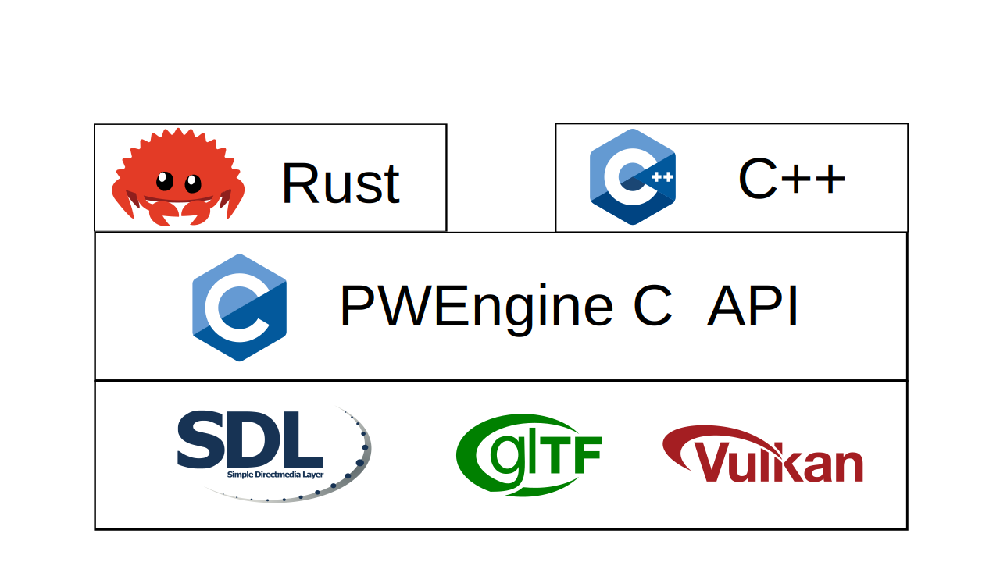

# PWEngine

**PWEngine is licensed under the GNU Lesser General Public License v3.0 (LGPLv3).**
**See COPYING (GPLv3 base) and COPYING.LESSER (LGPLv3 additional terms) for details.**

PWEngine is a lite game engine and ui framework, based by SDL renderer and SDL GPU.  
The PWEngine have:
1. Lite. Not a industry game engine or ui framework. Lite package, Less Memory.
2. Simple. Learn it is very easy. We support so many demo and document.
3. 100% OpenSource. Unlike Qt or UE, we never have any double license.
4. MutliLanguage. Not only the Rust/C++. if the language support C library, you can developing by it.

## What can it do
1. Design simple UI application.(1.0)
2. Design 2D pixel or style game.(1.0)
3. Design simple 3D game.(2.0)
4. Use Editor to design middle 3D game(3.0)

## Programming Language & Framework
We both like C++ & Rust. Do not talk about who is better.  
Official Support Language: C++, Rust, C#(Experience), Python(Experience). 

## Standard Assets Format
PWEngine support developer use Standard Format.
1. Image: `.png` `.bmp` File -> GIMP Krita
2. 3D Model: `.glb` `.obj` File -> Blender
3. Audio: `.ogg` File
4. Font: `.ttf` `.otf` File
5. Shader: `.glsl` File
6. Video: `.webm` File (If have) -> Kdenlive

## NO DRM (Digital Restrictions Management)

PWEngine NEVER allow any code for DRM, include:
1. DRM Platform/Device: such as iOS, XBox, PlayStation, Switch etc.
2. DRM Tool: Anti-cheating, Code obfuscation.
3. DRM MEDIA: The media format must not have any DRM.

PWEngine never support this code, do not pull your PR which include them.

## Why it call simple
1. Support XML to design UI.
2. Provide entity template and scene template.
3. Auto database and map builder.
4. An Editor to help you build scene.

## Version Different
### 1.x 2D UI/Game Library
1. Simple UI Design. Use XML or DOM.
2. 2D Plane Game
3. 2D Vertical Game
4. Visual Novel Game(galgame)
### 2.x Simple 3D Game Engine
### 3.x Middle 3D Game Engine with Editor

